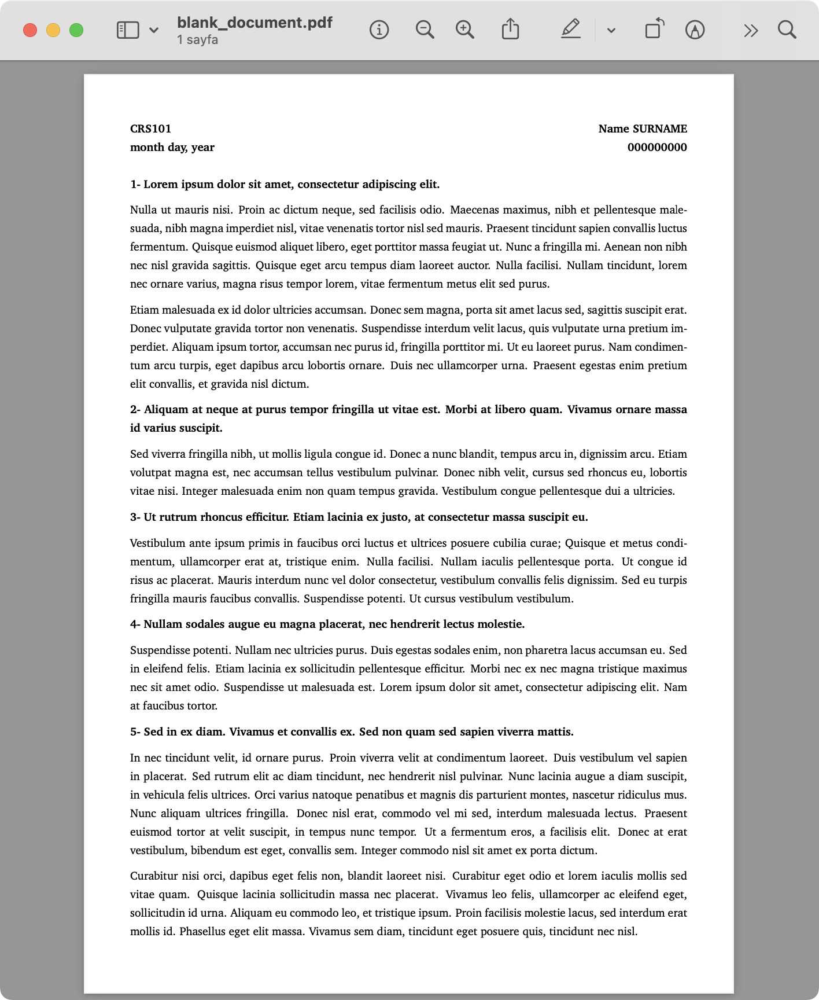

# LaTeX Templates

This repository contains a collection of LaTeX document templates for various use cases. LaTeX is a powerful typesetting system widely used for producing professional-looking documents, especially in the academic and scientific communities. These templates aim to provide a starting point for creating well-formatted documents with ease.

## Features

- Clean and professional design
- Structured sections for easy organization
- Customizable placeholders for entering your own content
- Properly formatted equations, figures, and tables

## Usage

To use the LaTeX templates, follow these steps:

1. Make sure you have LaTeX installed on your system. If not, you can download and install it from the [LaTeX Project website](https://www.latex-project.org/get/).

2. Clone this repository to your local machine using the following command:

   ```bash
   git clone https://github.com/berkaayildiz/latex-templates.git
   ```

3. Navigate to the desired template directory within the repository.

4. Open the main `.tex` file of the template using a LaTeX editor of your choice (e.g., [TeXstudio](https://www.texstudio.org/), [Overleaf](https://www.overleaf.com/)).

5. Replace the placeholder content with your own document content, such as text, equations, figures, and tables. Customize the template to suit your specific requirements.

6. Compile the LaTeX document to generate the final output. This can typically be done by clicking the "Compile" or "Build" button in your LaTeX editor.

7. Review and share the generated output document, which is typically a PDF file.

Feel free to modify the templates to fit your preferences and specific document guidelines. You can adjust the styling, add additional packages, or make any other necessary changes.

## Templates

### Blank Document Template

The Blank Document Template is a simple and clean LaTeX template that can be used for any type of document. You can use it for drafting, quick notes or homeworks.

<p align="center">
    
</p>

It comes with necessary packages to get you started with writing your document.

### Physics Lab Report Template

The Physics Lab Report Template is designed specifically for writing laboratory reports in the field of physics. It provides a structured layout that includes all the essential sections typically found in a physics lab report, such as an abstract, introduction, procedure, experimental data, answers to questions, and conclusion.

It is specifically designed for use in the PHYS121 and PHYS122 courses at the İzmir Institute of Technology, but it can be easily adapted for other courses and institutions or for general use.

<p align="center">
    
</p>

Use this as a starting point for documenting your physics experiments. Fill in the provided sections with your experiment details, observations, data, and analysis. Add or remove sections as needed to fit your specific requirements.

## Contributing

Contributions to this repository are welcome! If you have any improvements or additional LaTeX templates that you would like to share, please feel free to submit a pull request. Ensure that your templates are well-documented and adhere to best practices.

## License

The LaTeX Templates repository is licensed under the [MIT License](LICENSE). You are free to use, modify, and distribute the templates as per the terms of this license. See the [LICENSE](LICENSE) file for more information.
